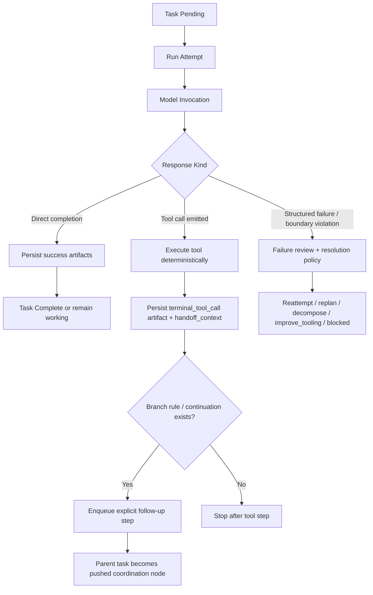

# Step Runtime Flow

Defines the intended control flow for bounded Strata task steps.

## Principles

- One `attempt` corresponds to one variance-bearing model invocation plus bounded deterministic fallout.
- If a step emits a tool call, the step ends there.
- Tool execution is deterministic fallout owned by the runtime, not an implicit invitation for the same model turn to continue.
- Any model reasoning over a tool result must happen in a later explicit step.
- Procedures may branch, but branching decisions are scheduler-owned and should be made from structured handoff state.

## Step Flow

## Handoff Contract

When a step ends in a tool call, the runtime should store:

- `tool_call.name`
- `tool_call.arguments`
- `tool_result_preview`
- `tool_result_full` when bounded
- `next_step_hint`
- `source_module`
- `avoid_repeating_first_tool`

Follow-up steps consume that handoff through `constraints.handoff_context`.

## Procedure Alignment

Research, implementation, decomposition, and tool repair should all fit the same substrate:

- Procedure definition chooses step role and constraints.
- Step runner invokes the model once.
- Runtime executes deterministic fallout.
- Scheduler decides next step from explicit continuation or branch rules.

This means Research is not a special exception to the ontology; it is a Procedure/task family with its own toolset and prompts.

## Branching Groundwork

Tasks may declare `tool_result_branches` in constraints. Each branch may match on:

- `tool_name`
- `result_contains`

And may specify:

- `next_title`
- `next_description`
- `task_type`
- `constraints`
- `stop_after_tool_step`

This is intentionally minimal groundwork. Richer branching should eventually support structured predicates over tool payloads rather than substring matching.

