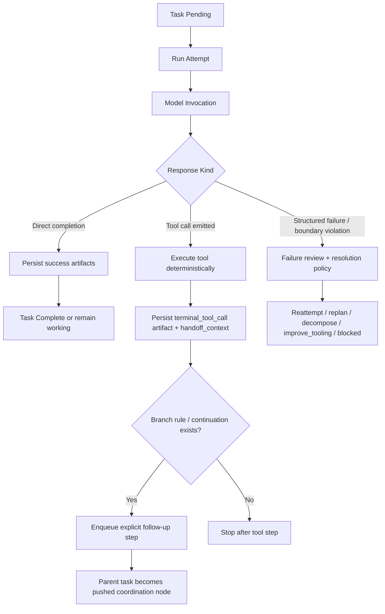

# Step Runtime Flow

Defines the intended control flow for bounded Strata task steps.

## Principles

- One `attempt` corresponds to one variance-bearing model invocation plus bounded deterministic fallout.
- If a step emits a tool call, the step ends there.
- Tool execution is deterministic fallout owned by the runtime, not an implicit invitation for the same model turn to continue.
- Any model reasoning over a tool result must happen in a later explicit step.
- Procedures may branch, but branching decisions are scheduler-owned and should be made from structured handoff state.

## Step Flow

## Handoff Contract

When a step ends in a tool call, the runtime should store:

- `tool_call.name`
- `tool_call.arguments`
- `tool_result_preview`
- `tool_result_full` when bounded
- `next_step_hint`
- `source_module`
- `avoid_repeating_first_tool`

Follow-up steps consume that handoff through `constraints.handoff_context`.

## Procedure Alignment

Research, implementation, decomposition, and tool repair should all fit the same substrate:

- Procedure definition chooses step role and constraints.
- Step runner invokes the model once.
- Runtime executes deterministic fallout.
- Scheduler decides next step from explicit continuation or branch rules.

This means Research is not a special exception to the ontology; it is a Procedure/task family with its own toolset and prompts.

## Self-Modification Direction

The same runtime model should apply to Strata's own machinery:

- `Verifier`, `Audit`, decomposition, and repair are system capabilities, not magical exceptions.
- A system capability should either be represented directly as a `Procedure`, as a tool, or as a thin runtime primitive that delegates to `Procedure` steps quickly.
- Capability outputs remain verifiable and auditable, including verifier outputs themselves.
- Repeated machinery failures should mark the capability `degraded` and queue bounded repair work.
- Repair work should target the owning artifact:
  - update a `Procedure` when the workflow is wrong
  - update a tool when execution logic is wrong
  - update a runtime primitive only when the behavior truly belongs below the Procedure/tool layer

This keeps “the system repairs itself” from becoming a parallel architecture. The repair path should operate on the same artifacts the runtime already executes.

## Escalation Rule

- `Verifier` may accept, revise, verify_more, escalate, or call for `Audit`.
- When a verifier outcome is severe, contradictory, or suggestive of damaged machinery, the runtime should be able to queue `Audit` immediately instead of waiting for a slower aggregate review path.
- When the same reusable tool or process fails repeatedly, the owning capability should be marked degraded and routed into explicit repair work.
- Capability degradation should latch immediately on a serious verifier/audit finding and should only clear when later audit or repair records explicit re-greening evidence.
- Audit should evaluate the incident against the capability version or snapshot that existed when the incident occurred whenever that state can be reconstructed.
- If the incident-time state was actually sound, the audit should treat the earlier supervisory judgment as the defective artifact and route repair there instead.

## Branching Groundwork

Tasks may declare `tool_result_branches` in constraints. Each branch may match on:

- `tool_name`
- `result_contains`

And may specify:

- `next_title`
- `next_description`
- `task_type`
- `constraints`
- `stop_after_tool_step`

This is intentionally minimal groundwork. Richer branching should eventually support structured predicates over tool payloads rather than substring matching.
