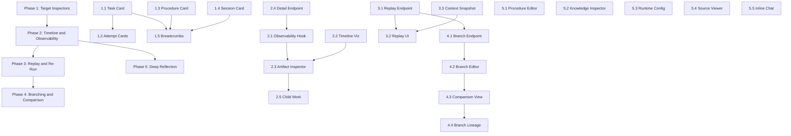

# Workbench Implementation Plan

> **Status**: Draft — pending operator review before subagent dispatch.
>
> **Objective**: Build Workbench from its current "target card + prompt composer" scaffold into the universal debugger described in [product-roadmap.md](file:///Users/jon/Projects/strata/docs/spec/product-roadmap.md) and [system-substrates.md](file:///Users/jon/Projects/strata/docs/spec/system-substrates.md).
>
> **Guiding principle**: Each phase is independently shippable. Later phases depend on data/APIs introduced by earlier phases but not on UI polish.

---

## Current State

The Workbench today ([NonChatContent.jsx](file:///Users/jon/Projects/strata/strata_ui/src/views/NonChatContent.jsx), `WorkbenchView` component, ~line 1314) has:

- ✅ Target selection via "Open in Workbench" from History, Procedures, and task cards
- ✅ Target metadata display (raw JSON dump)
- ✅ Cross-linking buttons (Open Task / Open Procedure / Open Session)
- ✅ Action prompt composer (Explain / Verify / Audit / Fix)
- ✅ Response mode toggle (Thinking / Instant), though this is currently misplaced and should become a scoped workbench configuration control rather than remain an inline chat-style selector
- ✅ Send to Chat (routes prompt through the linked session or current lane)
- ✅ Recent session messages panel for session-linked targets

What it does **not** do yet:

- ❌ Structured display of task/attempt execution timeline
- ❌ Attempt-level input/output/artifact inspection
- ❌ Observability artifact drilldown (plan reviews, autopsies, tool traces)
- ❌ Replay or re-run of an attempt from modified inputs
- ❌ Branching (modify context/model/tool selection, compare outcomes)
- ❌ Verification/audit drilldown as first-class subflows
- ❌ Deep reflection into Strata's own source, Procedures, Knowledge, or UI
- ❌ Scoped runtime controls for the target being inspected, such as per-lane throttle posture or explicit `instant` overrides for bounded workbench-driven executions

---

## Phase 1 — Target Inspector Enrichment

**Goal**: Replace the raw JSON metadata blob with structured, purpose-built displays for each target kind (task, attempt, procedure, session, lane step). This is the highest-leverage quick win — it makes Workbench immediately useful for daily inspection without requiring any new backend work.

### Task 1.0 — Move Misplaced Global Controls Into Scoped Surfaces

**Files**:
- [App.jsx](file:///Users/jon/Projects/strata/strata_ui/src/App.jsx)
- [NonChatContent.jsx](file:///Users/jon/Projects/strata/strata_ui/src/views/NonChatContent.jsx)

Before adding richer inspectors, remove the controls that are currently teaching the wrong product model:

- move throttle posture off the top-level global strip and attach it to the relevant agent/lane card or tab
- remove the `Thinking` / `Instant` selector from normal chat composition
- re-home `instant` selection as a workbench/process configuration control for executions where the operator is deliberately choosing to short-circuit reasoning
- preserve room for a future routing module that automatically decides whether to think, with explicit workbench overrides treated as exceptions rather than the default interaction pattern
- trim or collapse heavy operational telemetry in the task pane so the pane can focus on active work rather than a dense metrics block

**Exit criteria**: The main chat surface no longer exposes a `Thinking` / `Instant` toggle, throttle is no longer presented as a global setting, and the task-pane telemetry footprint is clearly reduced or demoted behind inspection affordances.

### Task 1.1 — Structured Task Target Card

**Files**: [NonChatContent.jsx](file:///Users/jon/Projects/strata/strata_ui/src/views/NonChatContent.jsx) (`WorkbenchView`)

Replace the raw `TARGET METADATA` panel with a purpose-built card when the target is a task. Display:

- Task ID, title, description
- Status badge (working / complete / blocked / abandoned) with appropriate tone colors
- Lane, scope, creation/update timestamps (using existing `formatAbsoluteWithRelative`)
- Parent task link (if `parent_id` exists)
- Active child IDs with count
- Constraints summary (procedure linkage, execution mode, lane)
- Pending question (if `pending_question` is present)

Preserve the raw JSON in a collapsible "Raw Metadata" section at the bottom.

**Data source**: `taskMatch` is already resolved from the flattened task tree via `allTasks.find()`. All task fields come from the `/tasks` API response.

**Exit criteria**: Opening a task in Workbench shows a structured card instead of a JSON blob. Raw JSON is still available on expand.

---

### Task 1.2 — Structured Attempt Cards

**Files**: [NonChatContent.jsx](file:///Users/jon/Projects/strata/strata_ui/src/views/NonChatContent.jsx) (`WorkbenchView`)

When the Workbench target has a `taskId`, fetch and display the task's attempts inline. For each attempt, show:

- Attempt ID, outcome badge (`succeeded` / `failed` / `cancelled`)
- Started/ended timestamps, duration
- Model, provider, token usage (from `attempt.artifacts`)
- Step history timeline (from `attempt.artifacts.step_history`) — each step as a compact row: `step` type, `label`, `detail`, `at` timestamp
- Evidence panel: `failure_kind`, autopsy summary, plan review
- Artifacts panel: tool calls, results, deterministic check outcomes

This data is already available in the `/tasks` endpoint response — attempts are nested under each task with `artifacts` and `evidence` dicts. No new backend endpoint is required.

**Exit criteria**: Task targets show attempt history with structured per-attempt cards. Each card is expandable.

---

### Task 1.3 — Structured Procedure Target Card

**Files**: [NonChatContent.jsx](file:///Users/jon/Projects/strata/strata_ui/src/views/NonChatContent.jsx) (`WorkbenchView`)

When the target has a `procedureId`, display a structured card using the existing `normalizeProcedureRecord` function:

- Procedure ID, title, summary
- Lifecycle state badge (`draft` / `tested` / `vetted` / `retired`) with `procedureLifecycleTone`
- Lineage ID, variant ID
- Checklist rendered as numbered steps with verification targets
- Stats: last run time, run count, last source task ID
- Description rendered as markdown (using `ReactMarkdown` + `remarkGfm`, already imported)

**Exit criteria**: Procedure targets show their checklist, lifecycle state, and stats in a readable card.

---

### Task 1.4 — Structured Session/Message Target Card

**Files**: [NonChatContent.jsx](file:///Users/jon/Projects/strata/strata_ui/src/views/NonChatContent.jsx) (`WorkbenchView`)

When the target has a `sessionId`, enhance the existing "RECENT SESSION MESSAGES" panel:

- Show session metadata (title, opened_by, source_kind, tags) if available from `message.message_metadata`
- Role-colored message rows: user → neutral tone, assistant → subtle purple/blue tone, system → amber tone
- Message metadata expansion (lane, delivery channel, audience, communicative act fields from `message_metadata`)
- Truncation with "Show more" for messages exceeding ~300 chars

**Exit criteria**: Session targets show message metadata and a more readable, role-differentiated message thread.

---

### Task 1.5 — Quick Navigation Breadcrumbs & History Stack

**Files**:
- [NonChatContent.jsx](file:///Users/jon/Projects/strata/strata_ui/src/views/NonChatContent.jsx) (`WorkbenchView`)
- [App.jsx](file:///Users/jon/Projects/strata/strata_ui/src/App.jsx) (state management)

Add a breadcrumb trail at the top of the Workbench showing the target's lineage:

- Format: `Task #abc123 → Parent #def456 → Procedure: My Procedure`
- Each breadcrumb segment is clickable — sets `workbenchTarget` to that entity

Add a `workbenchHistory` state array (max 10 entries) in `App.jsx`:

```javascript
const [workbenchHistory, setWorkbenchHistory] = useState([]);
```

Pass `onPushWorkbenchTarget` and `onPopWorkbenchTarget` callbacks through `workbenchProps`. Push the current target onto history before navigating to a new one.

Add a "← Back" button in the Workbench header that pops the history stack.

**Exit criteria**: Operator can navigate between related targets and go back through their inspection history.

---

## Phase 2 — Attempt Timeline & Observability Drilldown

**Goal**: Make attempt-level execution fully inspectable by consuming the existing observability API. This is the first phase that requires new UI ↔ backend data flow beyond what the current `/tasks` endpoint provides.

### Task 2.1 — Observability Artifact Fetcher

**Files**: New file `strata_ui/src/hooks/useWorkbenchData.js`

Create a custom React hook that calls:

```
GET /admin/observability/attempts?task_id={taskId}
```

This endpoint already exists in [runtime_admin.py](file:///Users/jon/Projects/strata/strata/api/runtime_admin.py#L299-L326). It returns structured artifacts including:

- `artifact_kind`: `plan_review`, `autopsy`, `tool_trace`, `verification`, etc.
- Full structured payloads per artifact

The hook should:
- Accept `taskId` and optionally `attemptId` as parameters
- Fetch on target change (when inputs change)
- Cache results using a simple ref-based cache keyed on `taskId`
- Expose `{ artifacts, loading, error, refetch }` return shape
- Handle API base URL from the existing `axios` config pattern in App.jsx

**Exit criteria**: A reusable hook correctly fetches observability artifacts for a focused task. Loading/error states are exposed.

---

### Task 2.2 — Attempt Execution Timeline Visualization

**Files**: [NonChatContent.jsx](file:///Users/jon/Projects/strata/strata_ui/src/views/NonChatContent.jsx) (new sub-component in the same file)

Add an `AttemptTimeline` sub-component. Render a visual timeline panel (`EXECUTION TIMELINE`) showing:

- A vertical timeline with a left border line connecting step nodes
- Each node shows: step type badge (using `RoutePill`), label, detail text, timestamp
- Color-coded by step type:
  - `research` → neutral/blue
  - `decompose` → purple
  - `implementation` → green
  - `deterministic_check` → amber
  - `attempt` → default
- Duration between consecutive steps shown as a small elapsed-time label between nodes
- The attempt outcome as a terminal node: green for `succeeded`, red for `failed` with the `reason` text

Visual style: Vertical left-border timeline using the existing design system — `DashboardPanel` wrapper, `RoutePill` badges, same color palette and font stack.

Data source: `attempt.artifacts.step_history` (array of `{ step, label, detail, at }` objects).

**Exit criteria**: Task targets show a visual step-by-step execution trace for each attempt.

---

### Task 2.3 — Observability Artifact Inspector

**Files**: [NonChatContent.jsx](file:///Users/jon/Projects/strata/strata_ui/src/views/NonChatContent.jsx) (new sub-component)

Add an `ObservabilityInspector` sub-component. For each artifact returned by the `useWorkbenchData` hook, render structured panels:

- **Plan Review** (`artifact_kind === "plan_review"`):
  - Review summary and recommended action as header pills
  - Review body rendered as markdown
- **Autopsy** (`artifact_kind === "autopsy"`):
  - Tool call: name + formatted arguments
  - Tool result preview (truncated to 500 chars with expand)
  - Next step hint
  - Failure kind badge
  - "Avoid repeating" guidance
- **Tool Trace** (`artifact_kind === "tool_trace"`):
  - Tool name, arguments (formatted JSON), result, duration
- **Verification** (`artifact_kind === "verification"`):
  - Decision badge (pass/fail/inconclusive)
  - Confidence score
  - Reasoning text

Fall back to raw JSON (using existing `stringifyJson`) for unknown `artifact_kind` values.

Each artifact panel should be collapsible, defaulting to collapsed except the first two.

**Exit criteria**: Observability artifacts are rendered as purpose-built cards, not raw JSON. Unknown kinds gracefully fall back to JSON.

---

### Task 2.4 — Backend: Task Detail Endpoint

**Files**: [runtime_admin.py](file:///Users/jon/Projects/strata/strata/api/runtime_admin.py) or [chat_task_admin.py](file:///Users/jon/Projects/strata/strata/api/chat_task_admin.py)

Add a dedicated endpoint:

```python
@app.get("/admin/tasks/{task_id}/detail")
async def get_task_detail(task_id: str, storage=Depends(get_storage)):
```

Returns a single consolidated response with:

| Field | Source |
|---|---|
| All task fields | `storage.tasks.get_by_id(task_id)` |
| All attempts with complete `artifacts` and `evidence` | `storage.attempts.get_by_task_id(task_id)` |
| Child task summaries (id, title, status, outcome of latest attempt) | Query children by `parent_task_id` |
| Parent task summary | `storage.tasks.get_by_id(task.parent_task_id)` |
| Linked observability artifacts | `list_attempt_observability_artifacts(storage, task_id=task_id)` |
| Linked procedure (if `constraints.procedure_id`) | `get_procedure(storage, procedure_id)` |

Return 404 if task not found.

This consolidates what the UI would otherwise assemble from multiple API calls.

**Exit criteria**: Single API call returns everything Workbench needs for deep task inspection. Test coverage in `tests/test_workbench_api.py`.

---

### Task 2.5 — Child Work Drilldown

**Files**: [NonChatContent.jsx](file:///Users/jon/Projects/strata/strata_ui/src/views/NonChatContent.jsx) (`WorkbenchView`)

When a task has `active_child_ids` or children visible in the task tree:

- Show a `CHILD WORK` dashboard panel listing each child with:
  - Title, status badge, outcome of latest attempt
  - Duration, lane
- Each child is clickable → pushes current target onto `workbenchHistory` and re-targets Workbench to the child
- Show execution mode (serial / parallel) at the top if present in `constraints.execution_mode`
- Show procedure linkage if present

**Data source**: Children are available in the task tree data already passed via `activeTasks` / `finishedTasks` props. For deeper detail, call the new detail endpoint from Task 2.4.

**Exit criteria**: Decomposed tasks show their child work tree; clicking a child navigates Workbench to it.

---

## Phase 3 — Replay & Re-Run

**Goal**: Let the operator re-run an attempt from its original context, and eventually from modified context. This is the first phase that introduces new backend behavior.

### Task 3.1 — Backend: Attempt Replay Endpoint

**Files**: [runtime_admin.py](file:///Users/jon/Projects/strata/strata/api/runtime_admin.py)

Add:

```python
@app.post("/admin/tasks/{task_id}/replay")
async def replay_task(task_id: str, payload: Dict[str, Any] = None, storage=Depends(get_storage)):
```

**Payload**:
```json
{
  "attempt_id": "optional — replay from this attempt's context snapshot",
  "model_override": "optional — use a different model for the replay",
  "tier_override": "optional — use a different tier (trainer/agent)",
  "extra_context": "optional — additional context to inject into the replay"
}
```

**Behavior**:
1. Look up the original task by `task_id` (404 if not found)
2. If `attempt_id` is given, look up that attempt and extract its `constraints` and `evidence` for context continuity
3. Create a new task:
   - Same `title` prefixed with `[Replay]`
   - Same `description`, `session_id`, `type`
   - Same `constraints` with:
     - `replay_source` metadata: `{ original_task_id, original_attempt_id }`
     - Model/tier overrides applied if provided
     - Extra context merged into `handoff_context`
   - `parent_task_id` set to original task (makes it a sibling/child for lineage tracking)
4. Set state to `PENDING`, commit, and enqueue via the worker
5. Return `{ status: "ok", task_id: <new_id>, replay_source: { ... } }`

This reuses existing task creation and worker infrastructure. It does **not** literally replay the LLM call — it re-runs the full task pipeline, which exercises decomposition, tool selection, and verification.

**Exit criteria**: Operator can trigger a re-run of any task from the API. The new task appears in the task tree with replay lineage. Test coverage in `tests/test_workbench_api.py`.

---

### Task 3.2 — UI: Replay Button and Status

**Files**:
- [NonChatContent.jsx](file:///Users/jon/Projects/strata/strata_ui/src/views/NonChatContent.jsx) (`WorkbenchView`)
- [App.jsx](file:///Users/jon/Projects/strata/strata_ui/src/App.jsx) (`workbenchProps` wiring)

Add a "Replay" button to:
- Each attempt card (from Task 1.2)
- The task target card header

Clicking opens a small inline form (not a full modal) with:
- Tier toggle (trainer / agent) — defaults to original tier
- Model override text input (optional, placeholder shows original model)
- Extra context textarea (optional)
- "Run Replay" submit button

On submit:
- Call `POST /admin/tasks/{task_id}/replay` with the assembled payload
- Show a green `operatorNotice` toast: `Replay queued as task {new_id}`
- Add the replay task to a list of "REPLAY RUNS" in the Workbench, each clickable to navigate

Wire through `workbenchProps` by adding an `onReplayTask` callback in `App.jsx`.

**Exit criteria**: Operator can trigger replay from the Workbench UI and navigate to the replay result.

---

### Task 3.3 — Backend: Attempt Context Snapshot

**Files**:
- [attempt_runner.py](file:///Users/jon/Projects/strata/strata/orchestrator/worker/attempt_runner.py) (in `run_attempt`, before model invocation)
- [writer.py](file:///Users/jon/Projects/strata/strata/observability/writer.py) (uses existing `enqueue_attempt_observability_artifact`)

Before each variance-bearing model invocation in `run_attempt` (approximately after step_history recording and before calling `_run_research` / `_run_implementation` / etc.), snapshot the assembled context:

```python
enqueue_attempt_observability_artifact({
    "task_id": task.task_id,
    "attempt_id": attempt.attempt_id,
    "session_id": task.session_id,
    "artifact_kind": "context_snapshot",
    "payload": {
        "task_type": task.type.value,
        "lane": infer_lane_from_task(task),
        "constraints_snapshot": dict(task.constraints or {}),
        "handoff_context": dict((task.constraints or {}).get("handoff_context") or {}),
        "procedure_id": str((task.constraints or {}).get("procedure_id") or ""),
        "depth": task.depth,
        "parent_task_id": str(task.parent_task_id or ""),
        "dependency_count": len(list(getattr(task, "dependencies", []) or [])),
    },
})
```

> [!NOTE]
> We intentionally do NOT snapshot the full assembled prompt text (which may be very large). The snapshot captures the structured inputs that *determined* what the prompt would be, which is more useful for replay and comparison.

**Exit criteria**: Each attempt records a context snapshot artifact. The artifact inspector from Task 2.3 renders it as a structured card. Test in `tests/test_workbench_api.py`.

---

## Phase 4 — Branching & Comparison

**Goal**: Let the operator create variant runs from modified context, then compare outcomes side-by-side. This turns Workbench from an inspector into a real debugger.

### Task 4.1 — Backend: Branch Endpoint

**Files**: [runtime_admin.py](file:///Users/jon/Projects/strata/strata/api/runtime_admin.py)

Add:

```python
@app.post("/admin/tasks/{task_id}/branch")
async def branch_task(task_id: str, payload: Dict[str, Any], storage=Depends(get_storage)):
```

**Payload**:
```json
{
  "from_attempt_id": "required — branch from this attempt's state",
  "modifications": {
    "model": "optional — override the model",
    "tier": "optional — override the tier",
    "extra_context": "optional — appended to handoff_context",
    "tool_whitelist": ["optional — restrict to these tools"],
    "tool_blacklist": ["optional — exclude these tools"],
    "constraints_patch": { "optional": "merged into task constraints" }
  },
  "label": "optional — human label for this branch"
}
```

**Behavior**:
1. Look up original task and attempt (404 if not found)
2. Create new task with same base constraints
3. Apply `modifications` into an extended constraints dict:
   - `branch_source`: `{ original_task_id, original_attempt_id, label }`
   - `model_override`, `tier_override` → set in constraints
   - `tool_whitelist`/`tool_blacklist` → set in constraints
   - `constraints_patch` → deep-merged into constraints
   - `extra_context` → merged into `handoff_context`
4. Title: `[Branch: {label}] {original_title}`
5. Set `parent_task_id` to original task for lineage
6. Enqueue

**Exit criteria**: Branching creates a correctly-configured variant task with modification metadata. Test coverage in `tests/test_workbench_api.py`.

---

### Task 4.2 — UI: Branch Editor

**Files**: [NonChatContent.jsx](file:///Users/jon/Projects/strata/strata_ui/src/views/NonChatContent.jsx) (`WorkbenchView`), [App.jsx](file:///Users/jon/Projects/strata/strata_ui/src/App.jsx)

Add a `BRANCH FROM THIS ATTEMPT` panel that appears when an attempt has a context snapshot:

- **Model selector**: Text input with current model pre-filled. Future improvement: dropdown from `/models` endpoint.
- **Tier toggle**: `trainer` / `agent` segmented control
- **Extra context**: Textarea for additional instructions to inject
- **Tool controls**: Comma-separated whitelist/blacklist text inputs (simple v1)
- **Branch label**: Text input for human-readable label
- **"Create Branch" button**: calls `POST /admin/tasks/{task_id}/branch`

Wire through `workbenchProps` with an `onBranchTask` callback.

After branch creation, show the new branch in a `BRANCHES` panel listing all child tasks that have `branch_source` in their constraints.

**Exit criteria**: Operator can modify any dimension of an attempt's context and create a branch from the Workbench UI.

---

### Task 4.3 — UI: Side-by-Side Comparison

**Files**: [NonChatContent.jsx](file:///Users/jon/Projects/strata/strata_ui/src/views/NonChatContent.jsx) (new `ComparisonPanel` sub-component)

Add a `COMPARE` panel activated by a "Compare" button on branch tasks:

- Select two tasks: the original and one of its branches
- Display them side by side in a two-column layout within the panel
- For each column, show:
  - Outcome badge, duration, model used
  - Step history summary (step count, key differences)
  - Tool calls used (highlight tools unique to each branch)
  - Token usage comparison
- Summary footer row: which branch was faster, which succeeded, notable differences

No new backend needed — this fetches both tasks' data from the detail endpoint and renders them together.

**Exit criteria**: Operator can compare an original and a branch side-by-side in the Workbench.

---

### Task 4.4 — Branch Lineage Visualization

**Files**: [NonChatContent.jsx](file:///Users/jon/Projects/strata/strata_ui/src/views/NonChatContent.jsx)

Add a `BRANCH LINEAGE` panel showing a simple tree:

- Root task at top as a row with title + outcome badge
- Each branch as an indented child row: `[Branch: label] title — outcome`
- Branches of branches further indented
- Click any node to navigate Workbench to that task

Build the tree by filtering the task tree for tasks whose `constraints.branch_source.original_task_id` matches the current root.

**Exit criteria**: Branch relationships are visualized as a navigable indented tree.

---

## Phase 5 — Deep Reflection & Self-Editing

**Goal**: Make Workbench the deepest reflection surface in the system. This phase lets the operator drill into Strata's own internals — Procedures, Knowledge, runtime config, and source.

### Task 5.1 — Procedure Lifecycle Editor

**Files**:
- [NonChatContent.jsx](file:///Users/jon/Projects/strata/strata_ui/src/views/NonChatContent.jsx) (`WorkbenchView`)
- Backend uses existing endpoints

When focusing a Procedure in Workbench, add an `EDIT PROCEDURE` panel:

- **Lifecycle state**: Segmented control to promote (`draft` → `tested` → `vetted`) or retire
- **Checklist editor**: Reorderable list of items. Each item has:
  - Title text input
  - Verification text input
  - Delete button
  - "Add Item" button at the bottom
- **Save**: Calls `POST /admin/procedures` with the updated procedure object
- **Queue Run**: Calls `POST /admin/procedures/{id}/queue` — button shown when procedure is saved

Both backend endpoints already exist in [runtime_admin.py](file:///Users/jon/Projects/strata/strata/api/runtime_admin.py#L371-L403).

**Exit criteria**: Operator can inspect and edit Procedures directly from Workbench.

---

### Task 5.2 — Knowledge Page Inspector

**Files**: [NonChatContent.jsx](file:///Users/jon/Projects/strata/strata_ui/src/views/NonChatContent.jsx) (`WorkbenchView`)

Add a knowledge page inspector that activates when a task/procedure context references a knowledge slug:

- Fetch page via `GET /admin/knowledge/pages/{slug}` (existing endpoint)
- Display content as rendered markdown
- Show metadata in pills: `domain`, `visibility_policy`, `freshness`
- Show `disclosure_rules` if present
- "Open in Knowledge" button → navigates to Knowledge view with that slug selected

Detection: Parse `constraints` for knowledge-related fields, or add a "View Related Knowledge" action button that prompts for a slug.

**Exit criteria**: Knowledge pages referenced in task/procedure context are inspectable from Workbench.

---

### Task 5.3 — Runtime Config Inspector

**Files**: [NonChatContent.jsx](file:///Users/jon/Projects/strata/strata_ui/src/views/NonChatContent.jsx) (`WorkbenchView`)

Add a `RUNTIME ENVIRONMENT` panel that shows live config relevant to the focused target:

- **Current routing** (from `GET /admin/routing`): model, provider, transport for the target's tier
- **Registry config**: The pool config for the target's tier from `GET /admin/registry`
- **Context pressure**: Loaded file count and budget from `GET /admin/context/loaded`
- **Host telemetry**: CPU, memory, thermal state from `GET /admin/host/telemetry`

Fetch these lazily (only when the panel is expanded) to avoid unnecessary API calls.

**Exit criteria**: Workbench shows the runtime environment that affected any focused target's execution.

---

### Task 5.4 — Source File Viewer

**Files**:
- [NonChatContent.jsx](file:///Users/jon/Projects/strata/strata_ui/src/views/NonChatContent.jsx) (`WorkbenchView`)
- [runtime_admin.py](file:///Users/jon/Projects/strata/strata/api/runtime_admin.py) (optional new endpoint)

When an attempt's tool trace references file paths, or when a Procedure's `preferred_paths` array is available:

- Show a `SOURCE FILES` panel listing referenced paths
- Click a path to expand an inline viewer
- Backend: Either use the existing log reader pattern or add a minimal endpoint:

```python
@app.get("/admin/source")
async def read_source_file(path: str):
    # Validate path is within the repo root, read and return content
```

- Display content in a `<pre>` block with `JetBrains Mono` font
- Line numbers in the gutter
- Syntax highlighting can be added as a follow-up (not required for v1)

**Exit criteria**: Source files referenced in task execution can be viewed inline in Workbench.

---

### Task 5.5 — Inline Workbench Chat Thread

**Files**:
- [NonChatContent.jsx](file:///Users/jon/Projects/strata/strata_ui/src/views/NonChatContent.jsx) (`WorkbenchView`)
- [App.jsx](file:///Users/jon/Projects/strata/strata_ui/src/App.jsx) (`workbenchProps` wiring)

Evolve the current one-shot prompt composer into a persistent inline chat thread:

- Track Workbench conversations via a dedicated session: `workbench:{targetKind}:{targetId}`
- Show the history of prompts sent and responses received for this target
- Filter `messages` by matching session ID to display the thread
- Keep the prompt composer at the bottom
- Auto-scroll to latest message

This turns "Send to Chat" from a fire-and-forget into a persistent investigation surface.

**Exit criteria**: Workbench has its own inline chat thread per target that preserves full conversation history.

---

## Cross-Cutting: Testing Strategy

### UI Component Tests

**File**: `strata_ui/src/__tests__/WorkbenchView.test.jsx` (new)

Use the project's existing test framework. For each phase, add tests covering:

| Phase | Test Cases |
|---|---|
| 1 | Structured task card renders correct fields from mock task data. Procedure card renders checklist. Session card renders role-colored messages. Breadcrumb navigation pushes/pops history. Raw JSON fallback works for unknown target shapes. |
| 2 | `useWorkbenchData` hook calls the correct API URL. Timeline renders correct number of step nodes. Artifact inspector renders different cards per `artifact_kind`. |
| 3 | Replay button assembles correct payload. Override inputs are included in API call. |
| 4 | Branch editor assembles correct payload with modifications. Comparison view renders two columns. |

### Backend Tests

**File**: `tests/test_workbench_api.py` (new)

| Task | Test Cases |
|---|---|
| 2.4 | `GET /admin/tasks/{id}/detail` returns all fields (task, attempts, children, parent, observability, procedure). Returns 404 for missing task. |
| 3.1 | `POST /admin/tasks/{id}/replay` creates new task with `replay_source` constraints. Overrides are applied. Enqueue is called. Returns 404 for missing task/attempt. |
| 3.3 | Context snapshot artifact is persisted with expected fields. |
| 4.1 | `POST /admin/tasks/{id}/branch` creates task with `branch_source`. Modifications are correctly merged. Label is applied to title. Returns 400 for missing `from_attempt_id`. |

### Integration Tests

**File**: `tests/test_workbench_integration.py` (new)

End-to-end flow tests (can use the existing test storage fixtures):

1. Create a task → let it complete (or mock completion)
2. Fetch via detail endpoint → verify all expected data
3. Trigger replay → verify new task has correct lineage
4. Trigger branch with model override → verify modifications in constraints
5. Fetch both original and branch via detail → verify comparison data

---

## Existing Backend APIs — No New Work Required

These endpoints already exist and can be consumed by Workbench immediately:

| Endpoint | Data | Used By |
|---|---|---|
| `GET /tasks` | Full tree with nested attempts, evidence, artifacts | 1, 2 |
| `GET /admin/observability/attempts` | Plan reviews, autopsies, tool traces | 2 |
| `GET /admin/routing` | Current model/tier/transport routing | 5 |
| `GET /admin/registry` | Model registry configuration | 3, 4 |
| `GET /admin/procedures` | All procedures with lifecycle/checklist | 1, 5 |
| `GET /admin/procedures/{id}` | Single procedure detail | 1, 5 |
| `POST /admin/procedures` | Upsert procedure | 5 |
| `POST /admin/procedures/{id}/queue` | Queue a procedure run | 5 |
| `GET /admin/context/loaded` | Currently loaded context files | 5 |
| `GET /admin/context/telemetry` | Context pressure data | 5 |
| `GET /admin/host/telemetry` | Host resource telemetry | 5 |
| `GET /admin/settings` | Runtime settings | 5 |
| `GET /admin/knowledge/pages` | Knowledge page index | 5 |
| `GET /admin/knowledge/pages/{slug}` | Full knowledge page content | 5 |
| `GET /models` | Available models list | 3, 4 |
| `POST /admin/tasks/{id}/pause` | Pause a task | — |
| `POST /admin/tasks/{id}/resume` | Resume a task | — |
| `POST /admin/tasks/{id}/stop` | Stop a task | — |

## New Backend APIs Required

| Endpoint | Phase | Purpose |
|---|---|---|
| `GET /admin/tasks/{task_id}/detail` | 2 | Consolidated deep task inspection |
| `POST /admin/tasks/{task_id}/replay` | 3 | Re-run a task from original or modified context |
| `POST /admin/tasks/{task_id}/branch` | 4 | Create a variant run with modifications |
| `GET /admin/source` (optional) | 5 | Read a source file by path |

---

## Dependency Map



## Subagent Dispatch Order

For parallel subagent execution, respect these dependency constraints:

**Batch 1** (all independent, no prerequisites):
- Tasks **1.1**, **1.2**, **1.3**, **1.4** — parallel UI-only work
- Task **2.4** — backend endpoint, independent of UI

**Batch 2** (depends on Batch 1):
- Task **1.5** — depends on 1.1–1.4 being merged for breadcrumb targets
- Tasks **2.1**, **2.2** — depend on 2.4 endpoint existing
- Task **3.1** — backend, independent of Phase 2 UI

**Batch 3** (depends on Batch 2):
- Tasks **2.3**, **2.5** — depend on 2.1 hook
- Task **3.2** — depends on 3.1 endpoint
- Task **3.3** — backend, can parallel with UI
- Task **4.1** — backend, depends on 3.1 pattern

**Batch 4** (depends on Batch 3):
- Tasks **4.2**, **4.3**, **4.4** — depend on 4.1
- Tasks **5.1**, **5.2**, **5.3**, **5.4** — independent, can parallel

**Batch 5** (final):
- Task **5.5** — should be last, benefits from all other phases
